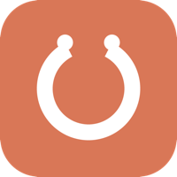

<div align="center">



# Claude Code Usage

**See your live Claude Code limits at a glance: the 5-hour session and the 7-day weekly window, with reset times.** A native macOS menu bar app, a Raycast extension, and an Alfred workflow, all reading the same numbers as the built-in `/usage` panel.

</div>

```
███░░░░░░░░░░░  18% used   Current session · resets in 2h 49m
█████░░░░░░░░░  35% used   Weekly · all models · resets Wed 10:29 PM
```

## Why

Claude Code shows usage only when you open the `/usage` panel. This project puts the same numbers where you already look: the macOS menu bar, Raycast, or Alfred. It reads your OAuth login and calls the same endpoint the `/usage` HUD uses, so there is no API key to set up and no local token counting to get wrong.

## Pick your surface

| Surface | Best for | Shows |
|---|---|---|
| **macOS menu bar app** | always-on glance next to the clock | `W 35% · C 18%` |
| **Raycast** | Raycast users, menu bar or command | full rows + menu bar title |
| **Alfred** | Alfred users | type `ccu` for rows |

All three share one core (`core/usage.mjs`) so the endpoint contract lives in one place.

## Install

Build any surface from source with the interactive script:

```bash
git clone https://github.com/narayann7/claude-usage-workflow
cd claude-usage-workflow
./build.sh        # menu: 1 alfred, 2 raycast, 3 macos, 4 all
```

Artifacts land in `.build/`.

### macOS menu bar app

```bash
./build.sh macos
open .build/ClaudeUsage.dmg
```

Drag **ClaudeUsage** onto **Applications**, then launch it. First launch: right-click the app and choose **Open** to clear Gatekeeper (the build is ad-hoc signed, not notarized). The usage shows up next to your clock. Click it for a detail popover with Refresh and Quit.

### Raycast

```bash
./build.sh raycast
```

In Raycast, run **Import Extension** and point it at the `raycast/` folder (or unzip `.build/raycast-extension.zip`). Two commands appear:

- **Claude Usage**: a detail list of all windows.
- **Claude Usage Menu Bar**: a compact `W 35% · C 18%` title that refreshes every 3 minutes.

### Alfred

```bash
./build.sh alfred
open ".build/Claude Code Usage.alfredworkflow"
```

Alfred imports it. Type **`ccu`** to see your session and weekly rows; press Enter to copy a one-line summary.

## Requirements

- **Signed into Claude Code** (`claude`). The token comes from your OAuth login, not an `ANTHROPIC_API_KEY`.
- **macOS** (all surfaces read the login from the Keychain).
- **Node 18+** for the Alfred and Raycast surfaces. The macOS app is a self-contained native binary.

## How it works

The usage numbers are not computed locally. They come from an undocumented, beta Anthropic endpoint that returns your authoritative limits:

```
GET https://api.anthropic.com/api/oauth/usage
```

Your OAuth token is read from the macOS Keychain (`Claude Code-credentials`), falling back to `~/.claude/.credentials.json`. Responses are cached for about 180 seconds to stay clear of rate limits. Nothing leaves your machine except the request to `api.anthropic.com`. Full details in [`docs/core.md`](docs/core.md).

## Caveats

- The endpoint and its dated beta header are undocumented and can change without notice.
- This reads your own account data, read-only, on demand. A header or policy change could break or block it.

## Project layout

```
core/     shared fetch + token + parse module (one source of truth)
macos/    native SwiftUI menu bar app
raycast/  Raycast extension
alfred/   Alfred workflow sources
build.sh  build any or all surfaces into .build/
```

## License

MIT.
